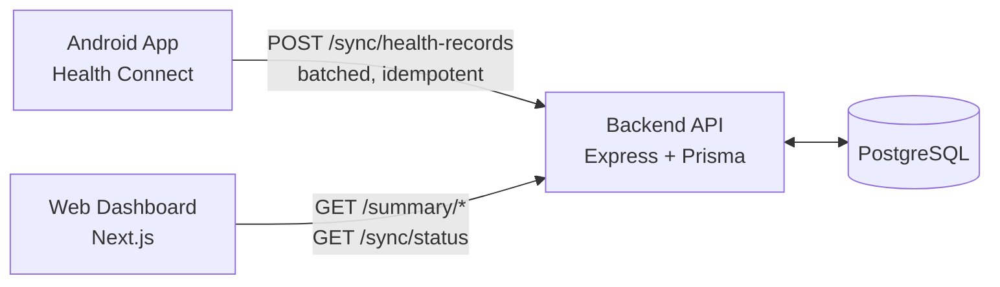

# Mobile Health Data Sync Platform

An Android app reads steps, distance, active calories, heart rate, and
sleep from Health Connect, uploads them to a backend that stores and
aggregates them idempotently, and a web dashboard visualizes the result.

## Stack

| Layer | Choice |
|---|---|
| Mobile | Kotlin + Jetpack Compose + Health Connect SDK + Retrofit |
| Backend | Node.js + Express + TypeScript + Prisma |
| Database | PostgreSQL |
| Frontend | Next.js + TypeScript + Tailwind + Recharts |

All four are the brief's own "preferred" options — there wasn't a reason
to deviate, and it keeps the project legible to anyone reviewing it
against the spec.

## Health parameters tracked (5 of 13)

**Steps, Distance, Active Calories Burned, Heart Rate, Sleep Duration.**
This set isn't arbitrary — it's exactly the parameters shown in the
brief's own example dashboard cards (section 9: *Today's Steps, Sleep,
Average Heart Rate, Calories Burned, Distance*), spanning three different
Health Connect categories (Activity, Heart, Sleep) rather than clustering
in one. Heart rate in particular was chosen deliberately because it
*can't* be aggregated the same way as the other four (summing bpm
readings is meaningless — only avg/min/max apply), which exercises the
aggregation logic's branching rather than letting every parameter take
the same code path. See `docs/ASSUMPTIONS.md` for the full reasoning.

## Architecture



The same `daily_health_summaries` table backs both the "today" cards and
the weekly/monthly trend charts — a given day's number is computed once,
by one code path (`backend/src/core/aggregation.ts`), no matter which
screen asks for it.

## Setup

Each component has its own README with exact commands:

- [`backend/README.md`](backend/README.md) — Postgres + API, `docker compose up` or local setup
- [`web/README.md`](web/README.md) — the dashboard, `npm install && npm run dev`
- [`android/README.md`](android/README.md) — opening in Android Studio, pointing it at your backend, getting test data onto a device

Quickest path to a fully running stack:

```bash
cd backend
cp .env.example .env   # set a real JWT_SECRET
docker compose up --build   # Postgres + API
npm run db:seed             # demo@independenceos.ai / DemoPass123!

cd ../web
cp .env.local.example .env.local
npm install && npm run dev  # http://localhost:3000
```

Then open `android/` in Android Studio, point `API_BASE_URL` at your
machine (the default `10.0.2.2` already works for the emulator), and run
it on a device/emulator with some Health Connect data available.

**For a standalone APK that works on any phone with no local setup** —
the actual target for this assignment — see
[`docs/DEPLOYMENT.md`](docs/DEPLOYMENT.md): deploy the backend to Railway
and the dashboard to Vercel (free tiers, ~45 minutes total), then build a
release APK pointing at the live backend. Install that APK on any phone,
anywhere, and it works without WiFi-matching or IP configuration.

## Demo flow

1. Sign in to the web dashboard with the seeded demo account — you'll see
   the empty state, since nothing's synced yet.
2. Run the Android app, grant Health Connect permissions, sign in with
   the same demo account, tap **Sync now**.
3. Refresh the dashboard — the summary cards, latest readings, and trend
   chart populate from what just synced.
4. Tap **Sync now** again with no new data on the phone — `recordsInserted`
   comes back `0` and `recordsSkippedAsDuplicate` matches what was just
   uploaded, demonstrating the idempotent upsert rather than just
   asserting it works.

## Live Demo

### Web Dashboard
https://health-sync-android-app.vercel.app

### Backend Health Endpoint
https://health-sync-android-app-production.up.railway.app/health

### APK
app-release.apk
https://drive.google.com/file/d/1jSbZfIJflcHI4R5Pcd_lD5PHPBD_LmUv/view?usp=drive_link

## Usage

1. Install the APK.
2. Sign in or create an account.
3. Grant Health Connect permissions.
4. Select a date range and tap **Sync Now**.
5. Open the dashboard using the **Open Dashboard** button in the app (or visit the web URL above).
6. View synced metrics and trends.

## What's actually verified vs. what needs your environment

This was built in a sandboxed environment with no internet access and no
Postgres/Android SDK installed, so honesty about what was and wasn't
checked seemed more useful than a description implying everything was
verified end-to-end:

- **Verified by actually running it:** the aggregation, idempotency-partition,
  date-bucketing, and weekly/monthly rollup logic in `backend/src/core/` —
  17 passing tests, runnable yourself with `npm test` in `backend/`, zero
  external dependencies required.
- **Written carefully, not executed here:** everything that needs Express,
  Prisma, a live Postgres connection, Next.js's build pipeline, or the
  Android Gradle Plugin/Health Connect on a real device. All of it should
  run as-is once you `npm install` / open Android Studio — but "should"
  is doing some work in that sentence, and it's worth your own test pass
  before relying on it for the actual interview.

## Further reading

- [`docs/DEPLOYMENT.md`](docs/DEPLOYMENT.md) — deploying so the app works standalone on any phone, no local setup
- [`docs/SCHEMA.md`](docs/SCHEMA.md) — table-by-table reasoning
- [`docs/API.md`](docs/API.md) — full request/response contract
- [`docs/ASSUMPTIONS.md`](docs/ASSUMPTIONS.md) — every deliberate tradeoff, in one place
